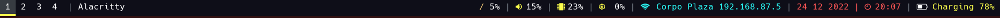
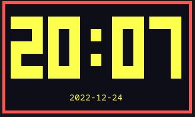
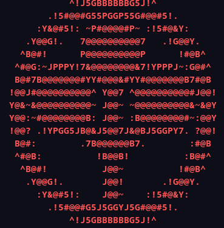

# arasaka-linux

This is a linux ricing project make linux with i3wm look like arasaka operating system inspired by  Cyberpunk 2077

<b>Requirment : </b>

<ul>
    <li>WM : i3wm</li>
    <li>Terminal : Alacritty</li>
    <li>brightnessctl (Laptop brightness control)</li>
    <li>bar : Polybar</li>
    <li>font : Hack Nerd Font</li>
    <li>Clock : tty-clock</li>
    <li>Rofi</li>
</ul>

<b>How to Install</b>

Install `brightnessctl`, 
Install `polybar` and rut it with default theme,
Install <b>Hack Nerd Font</b>
Install `rofi`
Copy the .dotfile (alacritty, i3, polybar, rofi) to `${HOME}/.config`,

Find me on Instagram : https://instagram.com/kcandradp

di edit langsung di remote

<b>Polybar</b>

Install <a href="https://github.com/polybar/polybar">Polybar</a>

Ubuntu : `$ sudo apt install polybar`

Fedora : `$ sudo dnf install polybar`

Arch : `$ sudo pacman -S polybar`

and run the default theme, copy polybar `config.ini` to `~/.config/polybar`.
For the Symbol on panel Install Hack Nerd Font

<b>Tty-clock</b>

install tty-clock available on `apt` and `pacman`, but not available on fedora must build the package from https://github.com/xorg62/tty-clock

<b>Arasaka Neofetch Logo</b>

the ASCII.txt logo is on the asset folder
Copy text , and replace `Qubes` distro logo on , `/usr/bin/neofetch`

Open neofetch config in `~/.config/neofetch/config.conf` , search `ascii_distro` change to `ascii_distro="Qubes"`
